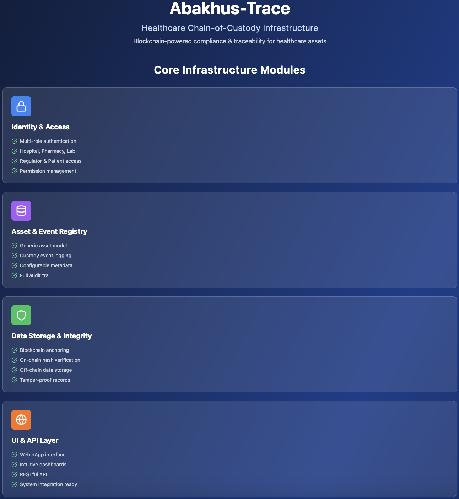
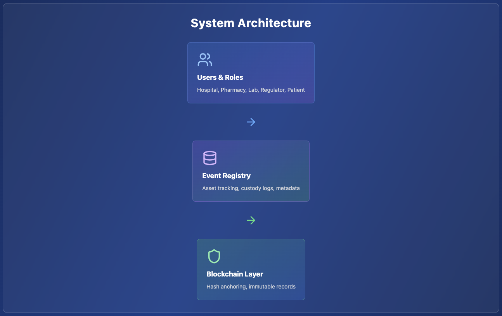
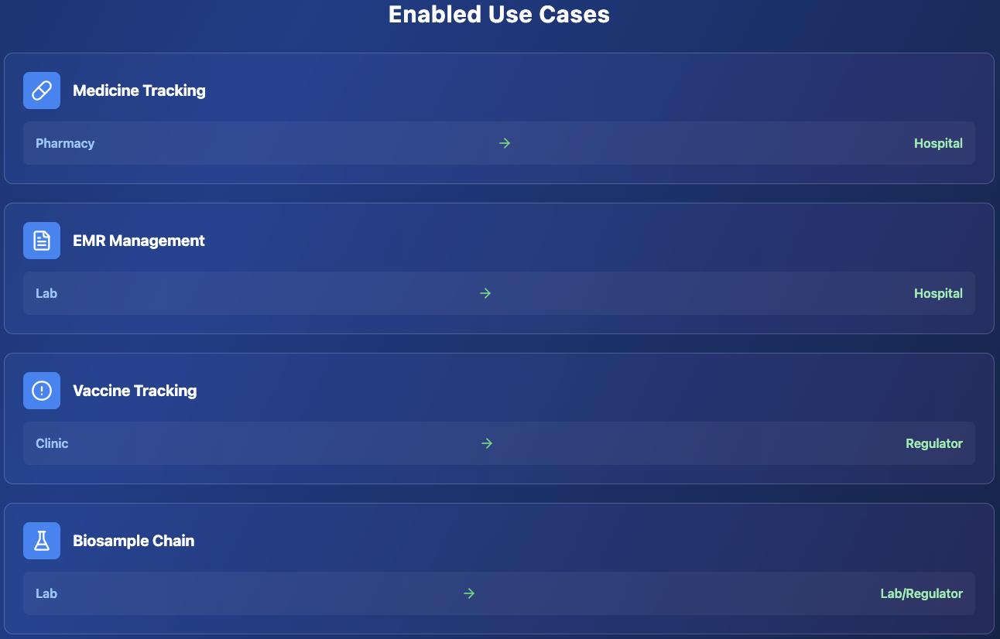
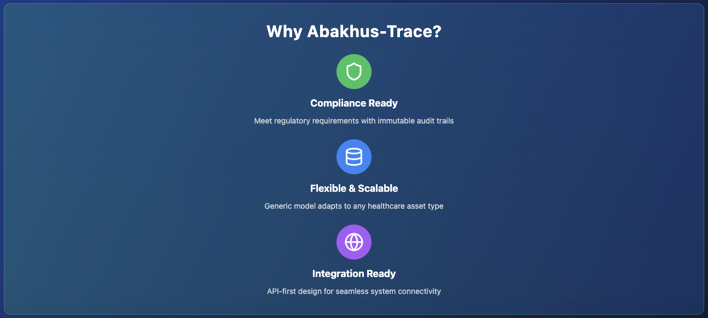

# Healthcare Chain-of-Custody / Compliance Infrastructure on Arbitrum Nova

# Abakhus-Trace Data Flow

After a deep research on COC (Chain of Custody) systems for emr, biological samples, vaccines and medicines we have mapped all the common events related to all those systems, then Abakhus-Trace will have a generic workflow for all those commom events and be flexible enough to add specific events when needed. Below is an example of Abakhus-Trace Data Flow specific for EMR

# Abakhus-Trace privacy-first approach

Check Abakhus-Trace video on privacy-preserving (zkproofs and hashes) approach [here](https://youtu.be/KlBr0G1Ibr8)

# Initial smart-contract prototyped and deployed at Arbitrum Sepolia

Abakhus-Trace contract deployed at Arbitrum Sepolia: [https://sepolia.arbiscan.io/address/0x650c65ccb7d5f430f87c16c9622e7bb9492fdef7](https://sepolia.arbiscan.io/address/0x650c65ccb7d5f430f87c16c9622e7bb9492fdef7)

# License

All rights reserved
